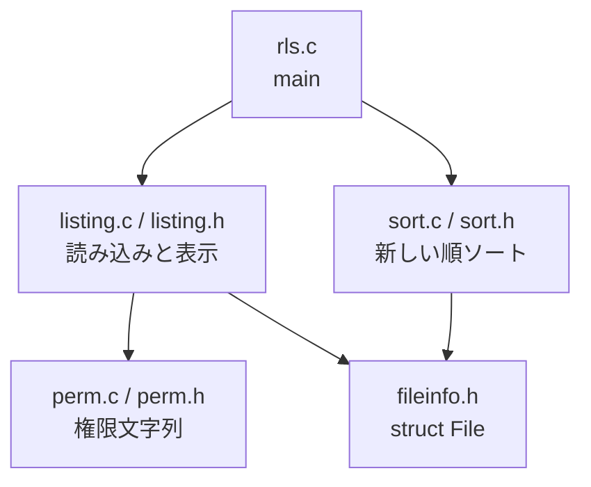

# ファイル構成

`rls` は機能ごとにソースを分けています。`rls.c` は流れだけを持ち、実処理は各モジュールにあります。

## 一覧

| ファイル | 役割 |
|---|---|
| `rls.c` | エントリポイント。バッファ設定 → 読み込み → ソート → 表示 |
| `fileinfo.h` | `struct File` と `MAX_FILES` の定義 |
| `perm.h` / `perm.c` | 権限を `drwxr-xr-x@` 形式にする |
| `sort.h` / `sort.c` | 更新時間の新しい順に並べる (`qsort` 用) |
| `listing.h` / `listing.c` | ディレクトリの読み込みと一覧表示（サイズ含む） |
| `Makefile` | 分割したソースのビルド（`-O2`） |
| `release.md` | リリースノート |
| `ファイル構成.md` | この説明 |
| `作業時間.txt` | 作業時間メモ |

## 依存関係



- `fileinfo.h` は共通のデータ型だけを持つ（`.c` はない）。`has_xattr` と表示用の `size` も含む
- `listing.c` が読み込み時に `fstatat` と `listxattr` で属性を集める
- 通常ファイルの `size` は `st_size`。ディレクトリは `dir_total_size()` で配下を再帰して合計する
- 表示時に `format_perm()` と `format_size()` を呼ぶ。サイズは `B` / `KB` / `MB` / `GB` / `TB`
- `perm.c` は渡されたモードと拡張属性フラグから文字列を作るだけ（システムコールはしない）
- `rls.c` は標準出力のバッファ設定と `tzset()` のあと、`collect_files()` → `qsort()` → `print_files()` の順で呼ぶ

## ビルド

```sh
make
./rls
```

中間ファイル（`.o`）と実行ファイルを消すときは `make clean` です。

`gcc rls.c -o rls` では他の `.c` がリンクされないので、分割後は `make` を使います。
